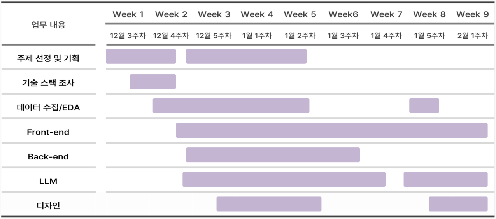
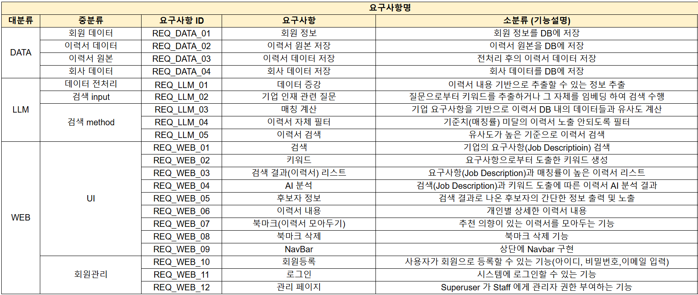
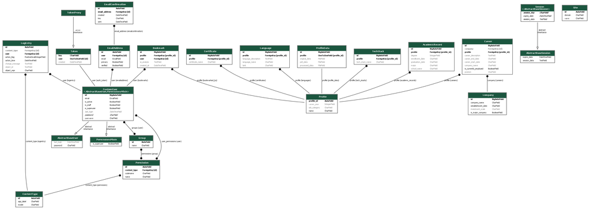
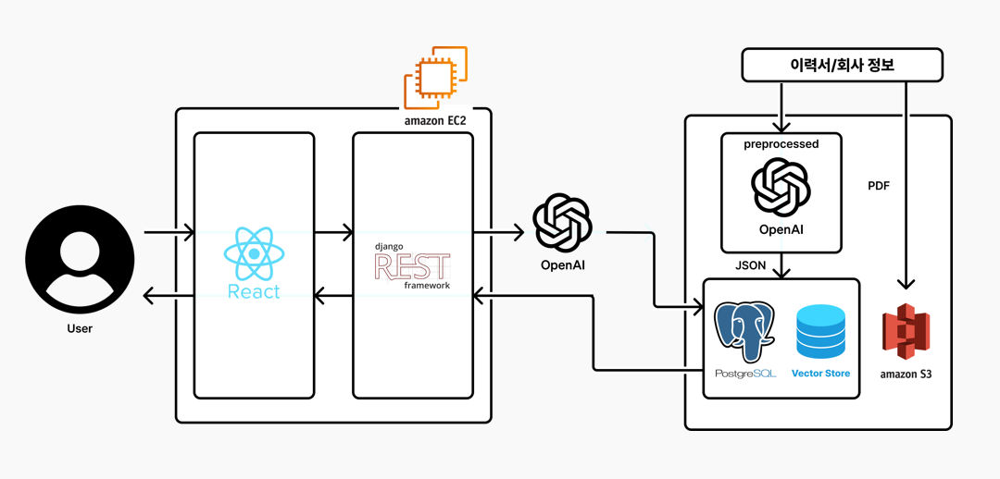

# SKN04-FINAL-2Team

# 👥 팀 소개

|**권오셈**|**고유림**|**신원영**|**전욱진**|
|:-------:|:-------:|:-------:|:-------:|
|  |  |  |  |
| **LLM** | **Frontend** | **Backend** | **Design** |

 
 

# 📑 프로젝트 개요
### 프로젝트 명 

  <b>🎁 GIFT (Genuine Information Finder Tool) 🎁</b>

### 프로젝트 목표
- 헤드헌터 맞춤형 LLM 활용 데이터 검색엔진

### 서비스 목표
- 헤드헌터가 요구하는 인재상을 입력하면, 이에 부합하는 후보자들의 이력서를 정확하고 효율적으로 검색 

### 주요 기능
- 자연어 입력으로 주요 이력내용에 부합하는 키워드 탐색
- 키워드 탐색 결과를 바탕으로 후보자들의 이력서를 정확하고 효율적으로 검색 및 반환
- 검색된 이력서를 북마크 및 히스토리 기능을 통해 다시 열람가능
- 특이한 이력 및 특수한 능력을 유사도 검색을 통하여 검색
- 로그인 및 회원가입 (회원 관리 기능)

 

# 🔨 기술 스택

### 🕹️ Frontend

### 🕹️ Backend

### 🕹️ AI & LLM

### 🕹️ Infra

 
 
  
# 📝 WBS

  <a href="https://skn04team2.atlassian.net/jira/software/projects/KAN/boards/1/timeline?epic=COMPLETE3M&selectedIssue=KAN-66&timeline=WEEKS&shared=&atlOrigin=eyJpIjoiZTlmYzgxNTU4NDU3NDJkNGFjMzhlOTEzM2NlZWRiMTkiLCJwIjoiaiJ9">
    WBS Link
  </a>

# ✅ 요구사항 명세서

  <a href="https://docs.google.com/spreadsheets/d/1TT68v488uhnggTSg5VvVn4JCz9T2NmqKsRPr9YBqMao/edit?gid=1408960755#gid=1408960755">
    요구사항 명세서
  </a>

# 💻 ERD

 
 

# 📚 시스템 아키텍처

 
 

# 🖥️ 수행결과

  
1. 로그인 화면

  - 서비스 접속 시 로그인 후에 서비스 이용

  

  
2. 메인화면

  - 로그인 후에 메인화면으로 이동

  

   

# 📝 프로젝트 회고

- 권오셈
    - 회고

- 고유림 
    - 회고
- 신원영
    - Django를 처음 접하면서 프로젝트에 JWT 인증과 DRF를 도입하는 과정에서 여러 가지 문제에 직면했습니다. 게다가 익숙하지 않은 ORM 사용법 때문에 기존의 SQL 접근 방식과는 다른 어려움도 겪었지만, 지속적인 문제 해결 노력과 학습을 통해 이를 점차 극복해 나갔습니다. 특히 ORM이 제공하는 코드의 간결성과 유지보수의 용이함을 경험하면서 그 강력함을 실감할 수 있었습니다.

- 전욱진
    - 회고

